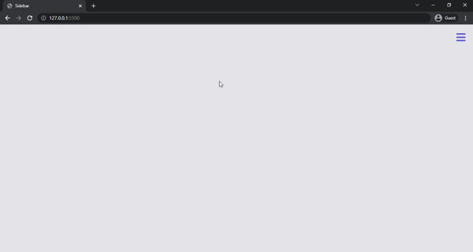

# Sidebar

Created a sidebar using the toggle method in this project.



## Used Technologies
* Javascript
* CSS
* HTML

## Installation
First clone the project.
```
git clone https://github.com/saglamburcu/sidebar-project.git
```

## Usage
After cloning the project, open it in Visual Studio Code.
```
cd sidebar-project
code .
```